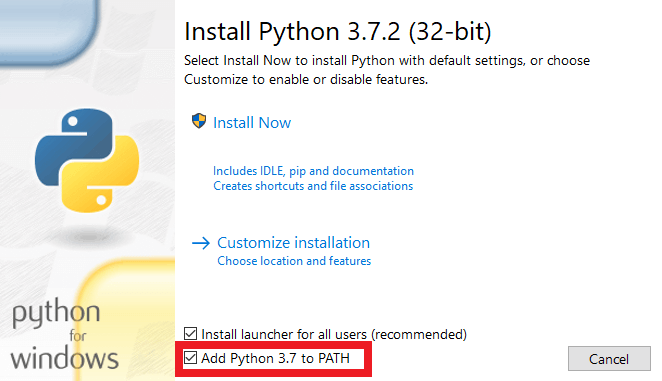

# How to install and use

1. Download python from here: https://www.python.org/downloads/
1.1 IMPORTANT: on python installation process, reminder to check the box "Add python to PATH"

2. Open your terminal (example: CMD), then run this command: pip install pytube
3. On your terminal navigate to folder that you save all files downloaded from here (github)
4. Run this command to start the script: python audio-dl.py
5. Input your URL and press ENTER
6. Wait...

## Dependencies
``` bash
python and pytube
```
